# Retro Bikes

[View the live project here.](https://will23jd.github.io/Retro-Bikes/)

 Retro bikes is a social mountain biking group that was created by people who love mountain biking for people who love mounation biking. Retro Bikes provides a community to keep people active and healthy on weekly mountain bike rides. Retro Bikes is aimed at people that what to get back out on their bike or if they want a group of people to ride with. The site provides the user place to get in touch to join the group and learn about the times, days, routes(*length and difficulty*) and any useful information such as what to bring for the rides(*helmet, water, spare tube*). 

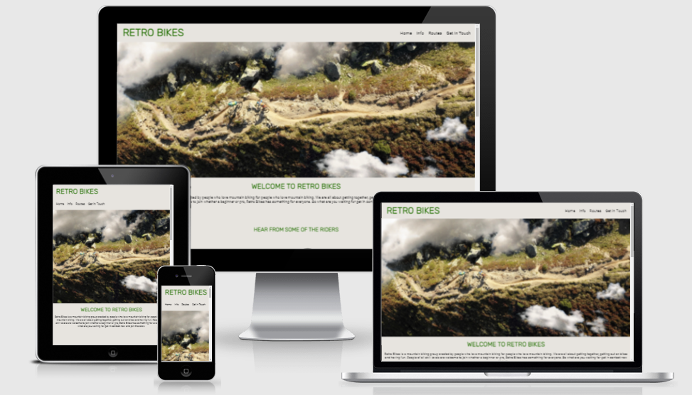

## User Experience (UX)

* ### Design 

    * ### Imagery 
    Imagery is very important as it catch's the user attention and provides extra context. The large hero image provides an instant knowledge of what the site is about. Smaller images provide context and meaning.

    * ### Color Scheme
    The main colors used are green and off-white.

    * ### Typography 
    The main font used is Roboto with a fall back of Sans Serif. Roboto is a clean simple font that is easy to read and works will with the h1 and h2 font which is Rubik. Rubik is a smooth and natural that fits in well as mountain biking is an sport that takes place in nature.

* ## Wireframes 

    * ### Landing Page 

    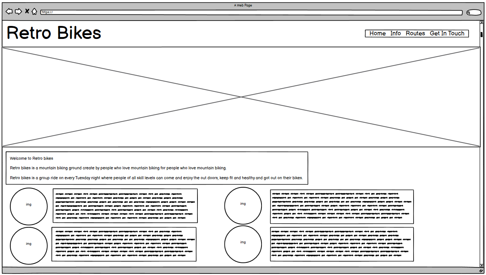
    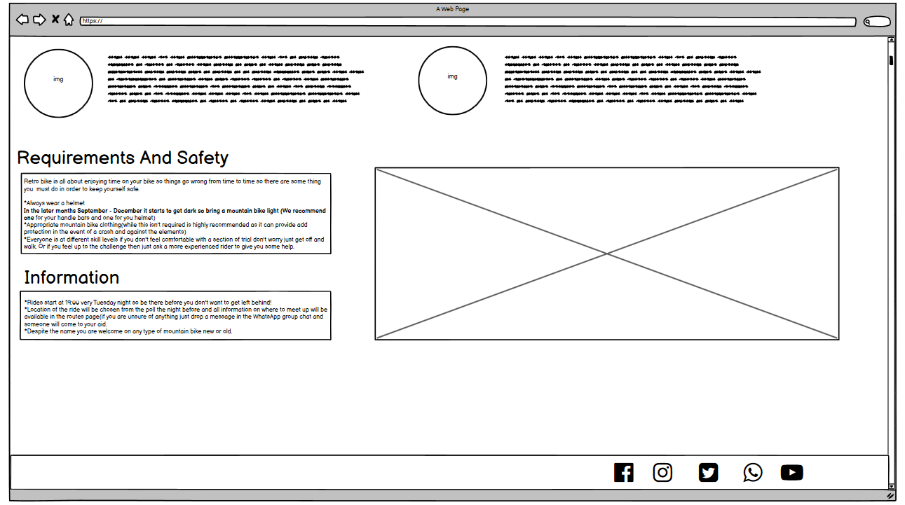

    * ### Routes Page

    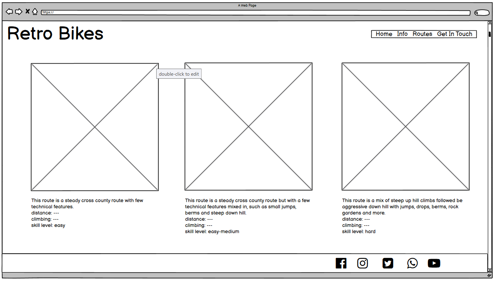

    * ### Get In Touch Page

    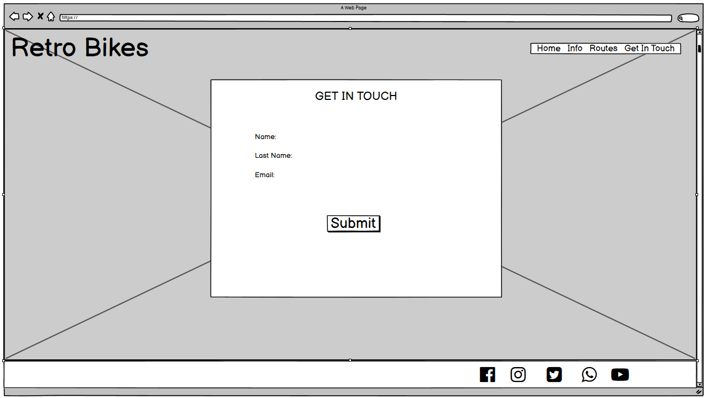

## Features

### Navigation

* At the top of the page is the group name in the left corner that links back to the home page. 
* On the right there are the other navigation links Home which links to the index.html page, Info which scrolls down to the infrmation section on the home page, Routes which takes you to the routes.html page and Get In Touch which takes you to the GetInTouch.html page.
* The navigation is set out in a clear and familiar way so the user can easly navigate the page as soon as they get to it.
* The logo is style in the same simple clean font as the other h1 and h2 elements with a green color the contrast with the back ground. The navigation links are in the same font color as the body element.

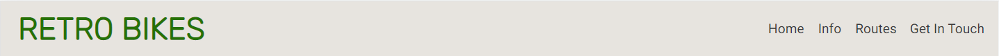

### Lading page image

* Hero image includes a photograph of 2 people riding there bike on a trail.
* This intoduces the user to Retro Bikes and lets them know what it's about.

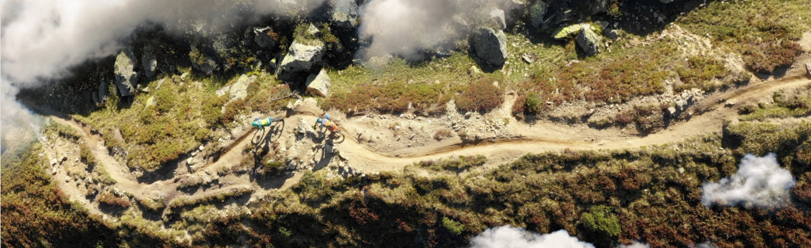

### Welcome to Retro Bikes and Hear From The Riders

* This section gives the user brief introduction into Retro Bikes and whats it's all about
* The 'hear from the riders section' lets the user hear from people that are in the group about what they like about it and why they go.

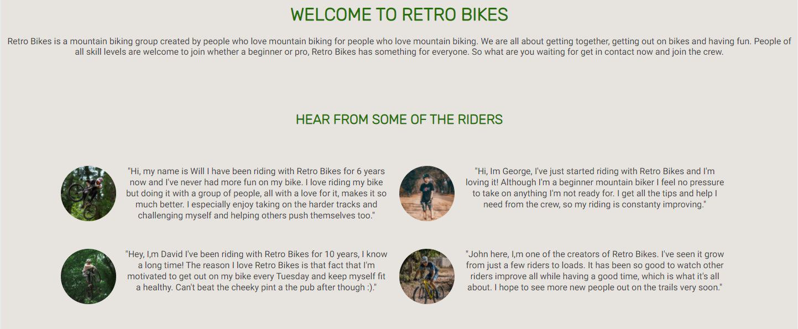

### Information and Safety

* Here the user can find information regarding the rides like time and location.
* In the section the user can see the requirements and safety that needs to be taken into account when riding in the group.

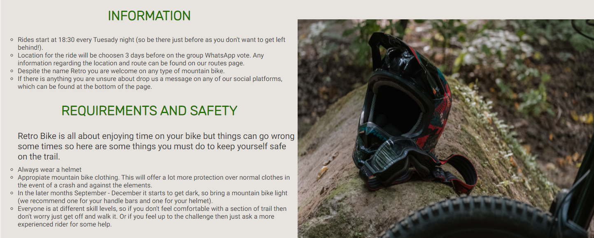

### footer

* Footer used to link the user to Retro Bikes social media. All links will open in a new tab for ease of navigation.
* Allows the user to keep in connected and find out more via social media

 

 ### Routes

* This page allows to user to see the different rides that the group goes on
* It also provides the user useful information about the ride such as skill level
* Like the home page this page includes the same navigation and footer to provide the user with a familiar layout for ease of navigation

 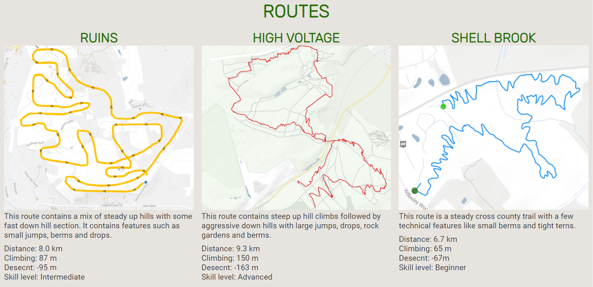

 ### Get In Touch

* This page provides a place for the user to leave their full name and email to get in touch with a lets ride submit button.
 
 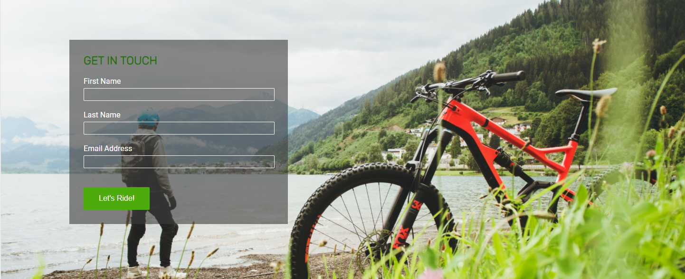

###  Features Left to Implement

* Adding more routes to the route page.

## Testing

### Navigation

* For testing the navigation I made sure all the links opened to the correct page from each different page without error.
* I tested that the page opens and works in browers: Chrome, FireFox, Safari and Bing.
* I confirmed that this project is responsive, keeps a consistent style, function as intended and looks good on all screen sizes using the devtools device toolbar and using the page on different devices.

### Get In Touch

* I have tested that the form will only submit with all the fields filled in and the email must be in the correct format.

### Validator Testing

* HTML
    * No errors were found when passing through the [official W3C validator](https://validator.w3.org/#validate_by_input) on the home, route and git in touch page.
* CSS
    * No errors were found when passing through the [official (Jigsaw) validator](https://jigsaw.w3.org/css-validator/#validate_by_input).
* Accessibility
    * I used lighthouse to confirmed all pages where easy to read and accessible.

    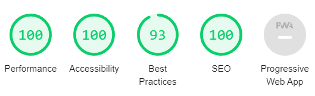

### Fixed Bugs 

* Hero image cropped out the riders below 400px so I added a new cropped image to fit the screen size.
* Logo had extra margin right causing the page to have horizontal scrolling, removing the margin extra solved the issue.

### Unfixed Bugs

* Images
Some images become distorted at unusual aspect ratios.

* Information 
The info buttom on the navigation just takes you to the home page on the Routes and Get In Touch page as it links to and id not a page.

## Technologies Used

### Languages Used

* HTML5
* CSS3

### Framework, Libraries and Programs used

* [Balsamiq](https://balsamiq.com/wireframes/):
    * Used to create wireframes in the desgin process.
* [Google Fonts](https://fonts.google.com/):
    * Google fonts was used to import the Roboto and Rubix fonts into css which is used on all pages.
* [Font Awesome](https://fontawesome.com/):
    * Used for the social media links in the footer.

## Deployment

### GitHub Pages

The project was deployed to GitHub Pages using the following steps...

1. Log in to GitHub and locate the [GitHub Repository](https://github.com/)
2. At the top of the Repository (not top of page), locate the "Settings" Button on the menu.
3. On the left side of the Settings page locate the pages Section (second to last one).
4. Under "Source", click the dropdown called "None" and select "main".
5. Refresh the page until it says your is published at:.
6. Click the link and it will take you to your page.

## Credits

### Code 

* CSS and HTML for footer used from Code Institute [Love Running](https://github.com/Code-Institute-Solutions/love-running-2.0-sourcecode) with changes to color, responsiveness and added Whats App link.
* CSS and HTML for Get In Touch basic sturture used from Code Institute [Love Running](https://github.com/Code-Institute-Solutions/love-running-2.0-sourcecode).

### Media

* Images sourced from [Pexels](https://www.pexels.com/).
* Route images sourced from [Trail Forks](https://www.trailforks.com/).

### Acknowledgements

* My Mentor for feedback throughout the project.
* Friends and family for help with testing and feedback